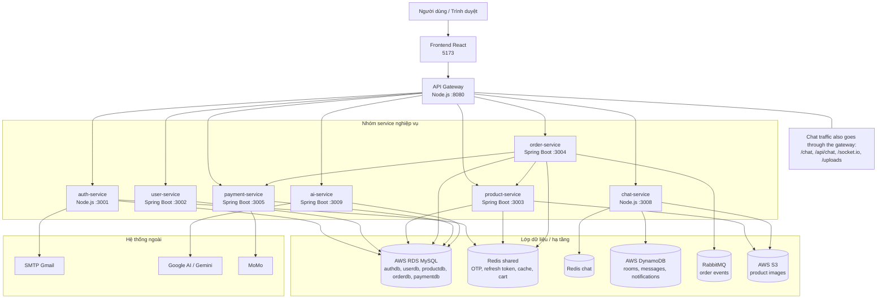

# Sơ đồ C2 toàn hệ thống DTPShop

Sơ đồ ảnh dễ xem hơn nằm ở [SYSTEM_C4_CONTAINER_DIAGRAM_CLEAN.png](SYSTEM_C4_CONTAINER_DIAGRAM_CLEAN.png). Bản Mermaid dưới đây giữ đúng luồng kiến trúc, trong đó `chat-service` đi qua `API Gateway` giống các service khác.

Ghi chú: `AWS RDS MySQL` là CSDL chính theo schema riêng cho từng service; `chat-service` dùng thêm `DynamoDB` và một Redis cache riêng.
