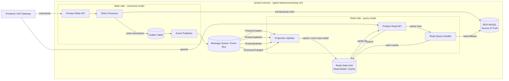

# Product Service - Space-Based C3 với CQRS và Message Queue

Tài liệu này mô tả thiết kế `product-service` theo hướng **space-based architecture** kết hợp **CQRS**. Mục tiêu chính là tách tải đọc/ghi, dùng Redis như data grid cho read model, dùng MySQL/RDS làm source of truth, và dùng message queue để đồng bộ bất đồng bộ giữa write side và read side.

## Ý tưởng kiến trúc

- **Write side** nhận các lệnh thay đổi dữ liệu: tạo/sửa/xóa sản phẩm, cập nhật tồn kho, thay đổi category.
- **Read side** phục vụ truy vấn catalog với latency thấp thông qua Redis read model/cache.
- **RDS MySQL** là nguồn dữ liệu chuẩn, có transaction và ràng buộc dữ liệu.
- **Redis data grid** giữ read model/cache, không đóng vai trò là queue bền vững cho write flow.
- **Message Queue/Event Bus** nhận domain event từ write side để projection updater cập nhật hoặc invalidate read model.
- **Outbox pattern** giúp tránh lỗi "ghi DB thành công nhưng publish event thất bại".

## Component C3

| Component | Vai trò |
| --- | --- |
| `Product Write API` | Nhận command từ admin hoặc service khác: create/update/delete product, update stock, reserve/refund inventory. |
| `Write Processor` | Validate nghiệp vụ, chạy transaction, ghi vào RDS MySQL, tạo outbox event. |
| `Outbox Table` | Lưu event trong cùng transaction với dữ liệu chính để không mất event sau khi commit. |
| `Event Publisher` | Poll outbox, publish event sang message queue, đánh dấu event đã gửi hoặc retry khi lỗi. |
| `Message Queue / Event Bus` | Kênh giao tiếp bất đồng bộ, đảm bảo delivery, retry, consumer isolation. Có thể dùng RabbitMQ/Kafka tùy hạ tầng. |
| `Projection Updater` | Consumer của read side, nhận event và cập nhật/invalidate Redis read model. |
| `Product Read API` | Nhận query từ frontend/API gateway: list product, detail product, filter, search. |
| `Read Query Handler` | Fallback xuống RDS khi cache miss, sau đó warm lại Redis. |
| `Redis Data Grid` | Read model/cache phân tán, tối ưu truy vấn đọc và giảm tải RDS. |
| `RDS MySQL` | Source of truth cho product, category, inventory và cart data hiện tại. |

## Write Flow

1. Frontend/API Gateway gửi command đến `Product Write API`.
2. `Write Processor` validate request và rule nghiệp vụ.
3. Trong cùng transaction, service ghi dữ liệu vào `RDS MySQL` và thêm event vào `Outbox Table`.
4. `Event Publisher` đọc event chưa gửi từ outbox và publish sang `Message Queue / Event Bus`.
5. `Projection Updater` consume event, cập nhật hoặc xóa key liên quan trong Redis.
6. Read side có thể phục vụ dữ liệu mới sau một khoảng trễ ngắn theo mô hình eventual consistency.

## Read Flow

1. Frontend/API Gateway gửi query đến `Product Read API`.
2. Read side kiểm tra `Redis Data Grid` trước.
3. Nếu cache hit, trả dữ liệu trực tiếp từ Redis.
4. Nếu cache miss, `Read Query Handler` đọc từ `RDS MySQL`.
5. Kết quả được ghi lại vào Redis với TTL phù hợp để các lần đọc sau nhanh hơn.

## Event đề xuất

| Event | Khi phát sinh | Tác động read model |
| --- | --- | --- |
| `ProductCreated` | Admin tạo sản phẩm mới | Upsert product detail, evict product list/search cache. |
| `ProductUpdated` | Admin sửa tên, mô tả, giá, ảnh, trạng thái | Upsert product detail, evict list/search/category cache. |
| `ProductDeleted` | Soft delete hoặc permanent delete | Evict product detail, list/search/category cache. |
| `InventoryChanged` | Reserve/refund/update stock | Update stock projection, evict product detail/list liên quan. |
| `CategoryChanged` | Tạo/sửa/xóa category | Evict category list và product list theo category. |

## Cache Key đề xuất

| Key | Nội dung | Ghi chú |
| --- | --- | --- |
| `product:{id}` | Chi tiết sản phẩm | Upsert/evict theo event của sản phẩm. |
| `products:list:{hash}` | Danh sách sản phẩm theo page/filter/sort | Evict theo tag hoặc pattern khi product/category thay đổi. |
| `products:search:{hash}` | Kết quả search | TTL ngắn hơn list thông thường. |
| `category:{id}` | Chi tiết category | Evict khi category thay đổi. |
| `categories:all` | Danh sách category | Evict khi category thay đổi. |

## Vì sao dùng Message Queue thay vì Redis làm queue ghi

- Queue cho write event cần delivery bền vững, retry, dead-letter queue và tách biệt consumer.
- Redis trong thiết kế này là data grid/cache, có thể bị eviction theo memory policy nên không nên là nguồn đảm bảo event.
- Message queue giúp read side xử lý event theo tốc độ riêng mà không chặn transaction ghi.
- Outbox + queue giảm rủi ro mất event khi service crash sau khi ghi DB.

## Mapping với product-service hiện tại

Hiện tại `product-service` đã có:

- Spring Boot + MySQL/RDS trong `application.yml`.
- Redis cache cho product catalog.
- API quản lý product, category, cart và inventory.
- Luồng inventory được `order-service` gọi qua `/api/inventory/reserve` và `/api/inventory/refund`.

Để tiến tới thiết kế trên, cần bổ sung:

1. `outbox_events` table trong database của `product-service`.
2. Event model cho `ProductCreated`, `ProductUpdated`, `ProductDeleted`, `InventoryChanged`, `CategoryChanged`.
3. Publisher chạy nền để gửi outbox event sang RabbitMQ/Kafka.
4. Consumer/projection updater để update hoặc invalidate Redis.
5. Tách rõ command method và query method trong service layer để áp dụng CQRS ở mức module.
6. Chính sách retry, idempotency và dead-letter queue cho consumer.

## Consistency và lỗi cần xử lý

- Read side là **eventually consistent**, dữ liệu đọc có thể trễ vài milliseconds đến vài seconds sau write.
- Event phải có `eventId`, `aggregateId`, `eventType`, `version`, `occurredAt` để consumer xử lý idempotent.
- Projection updater nên bỏ qua event cũ hơn version hiện tại của read model.
- Nếu Redis lỗi, read API vẫn fallback được xuống RDS.
- Nếu queue lỗi, outbox giữ event để publisher retry.
- Nếu consumer lỗi nhiều lần, event đi vào dead-letter queue để kiểm tra thủ công.

## Kết luận

Thiết kế này giữ `RDS MySQL` làm source of truth, dùng `Redis` đúng vai trò data grid/read model, và dùng `Message Queue/Event Bus` cho luồng đồng bộ CQRS. Cách tách này phù hợp với product catalog vì traffic đọc thường cao hơn traffic ghi, đồng thời vẫn giữ được độ tin cậy cho các thay đổi quan trọng như giá, trạng thái sản phẩm và tồn kho.
